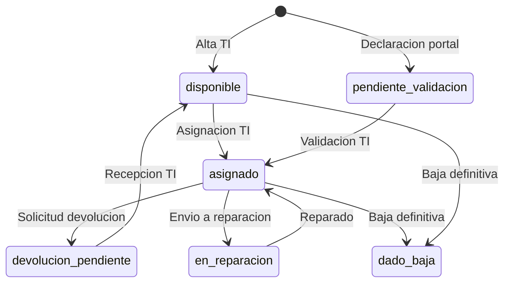

# Plan simple — Activos, relaciones e historial

## Objetivo

Gestionar el ciclo de vida de equipos (notebook, celular, etc.) con trazabilidad entre **activo**, **trabajador**, **contrato laboral**, **proveedor** y **acuerdo de adquisicion/arriendo**.

## Modelo de datos (resumen)

```
proveedores_activo ──┐
                     ├── activos_acuerdos ── activos ── activos_historial
trabajadores ────────┘         │
       │                       │
       └──── id_trabajador_asignado (asignacion vigente en activos)
```

| Tabla | Rol |
|-------|-----|
| `activos` | Inventario maestro (tu tabla actual) |
| `proveedores_activo` | Quien vendio/arrienda/mantiene el equipo |
| `activos_acuerdos` | Contrato o comodato del activo + contexto laboral del trabajador |
| `activos_historial` | Bitacora inmutable de eventos |
| `cat_tipo_activo` / `cat_estado_activo` | Catalogos para integridad |

## Flujo del activo



## Quien ingresa que datos

### Fase 1 — Portal del trabajador (ya implementado)

| Accion | Quien | Tabla | Estado resultante |
|--------|-------|-------|-------------------|
| Ver equipos asignados | Trabajador | `activos` | Solo lectura |
| Declarar equipo recibido | Trabajador | `activos` | `pendiente_validacion` |
| Solicitar devolucion | Trabajador | `activos` + `activos_historial` | `devolucion_pendiente` |

Campos que completa el trabajador: `tipo`, `marca`, `modelo`, `identificador_unico`, `fecha_asignacion`, y en `detalles_adicionales`: serie, inventario, observaciones, proveedor declarado.

### Fase 2 — Backoffice TI / Activos (pendiente, recomendado)

| Accion | Quien | Tablas |
|--------|-------|--------|
| Validar declaracion del portal | TI | `activos` → `asignado` |
| Registrar proveedor | TI | `proveedores_activo` |
| Vincular acuerdo de compra/arriendo | TI | `activos_acuerdos` |
| Asignar activo desde bodega | TI | `activos` + historial automatico |
| Reasignar a otro trabajador | TI | `activos` + historial |
| Dar de baja | TI | `activos.estado = dado_baja` |

Al crear un acuerdo, copiar desde `trabajadores`: `tipo_contrato` y `fecha_vencimiento_contrato` en `activos_acuerdos` para dejar contexto laboral al momento de la entrega.

### Fase 3 — Reportes (futuro)

- Activos por trabajador y por estado
- Activos con acuerdo por vencer
- Historial completo por `identificador_unico`

## Reglas de integridad

1. `identificador_unico` es **unico** en todo el inventario (serie o codigo de inventario).
2. `tipo` y `estado` deben existir en catalogos (`cat_tipo_activo`, `cat_estado_activo`).
3. `id_trabajador_asignado` referencia `trabajadores.id_trabajador`.
4. El historial se genera automaticamente con trigger; el portal puede agregar eventos `confirmacion_trabajador` o `solicitud_devolucion`.
5. El trabajador **no elimina** activos; solo solicita devolucion.

## Orden de ejecucion SQL en Supabase

1. `schema.sql`
2. `schema_normativa.sql` (sin tabla duplicada de activos)
3. `schema_activos.sql`

## Proximo paso sugerido

Crear una vista admin o hoja de calculo conectada a Supabase para que TI valide registros en `pendiente_validacion` y complete proveedor + acuerdo.
