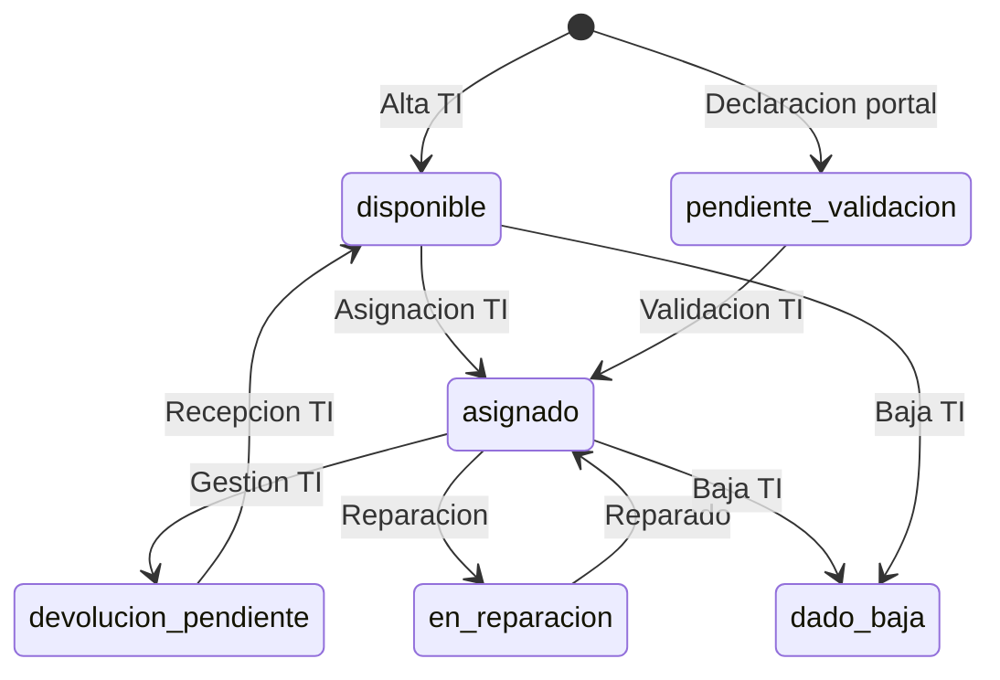

# Plan — Modulo de equipos (seccion 9 del portal)

**Portal:** v1.0.1.1 · **Produccion:** `https://valida-bd.vercel.app`

---

## Funcion del modulo (para uso futuro)

Este modulo **no es un inventario completo ni un CMDB**. Su rol en el portal del trabajador es:

1. **Declaracion referencial y opcional** del equipo que usa el trabajador (notebook de empresa o computador propio).
2. **Consulta** de declaraciones o asignaciones previas ya registradas en `activos`.
3. **Un solo guardado**, junto con la confirmacion legal al final del formulario (sin botones intermedios).

El trabajador **no administra** el ciclo de vida del activo (no valida, no devuelve, no da de baja). Eso corresponde a **TI / Activos** en backoffice o Supabase.

### Que hace el portal hoy

| Accion | Implementado | Detalle |
|--------|--------------|---------|
| Ver equipos previos | Si | Lista solo lectura desde `activos` |
| Declarar equipo | Si | Formulario seccion 9; se guarda al **Confirmar y enviar** |
| Editar activo en BD | No | Solo lectura |
| Solicitar devolucion | No | Eliminado del portal (gestion TI) |
| Multiples guardados intermedios | No | Eliminado (evita errores y duplicados) |

### Tipos de equipo en el portal

| Opcion UI | `activos.tipo` | `detalles_adicionales.origen_equipo` |
|-----------|----------------|--------------------------------------|
| Notebook entregado por Monitoring | `Notebook` | `empresa` |
| Computador propio | `Computador propio` | `propio` |

Tipos legacy en catalogo (`Celular`, `Monitor`, etc.) quedan **inactivos**; el portal solo inserta los dos tipos anteriores.

### Cuando se guarda una declaracion

- El usuario debe **interactuar** con la seccion 9 (cambiar radio, escribir en un campo, etc.). Si no toca el formulario, **no se inserta** nada.
- Al pulsar **Confirmar y guardar** (tras checkbox legal), el flujo ejecuta `guardarActivoDesdeFormulario()` junto con el resto de pasos de confirmacion.
- Estado insertado: `pendiente_validacion` (TI debe revisar y pasar a `asignado` u otro estado).

### Campos que envia el portal

| Columna `activos` | Origen |
|-------------------|--------|
| `tipo` | Notebook / Computador propio |
| `marca` | Usuario o default `Sin indicar` / `Equipo personal` |
| `modelo` | Usuario o default `Sin indicar` |
| `identificador_unico` | Serie del usuario, o auto `NB-…` / `PROPIO-…` |
| `estado` | `pendiente_validacion` |
| `id_trabajador_asignado` | Sesion actual |
| `detalles_adicionales` | JSON (ver abajo) |

**JSON `detalles_adicionales` (referencial):**

```json
{
  "origen": "portal",
  "origen_equipo": "empresa | propio",
  "es_equipo_personal": false,
  "conoce_caracteristicas": true,
  "numero_serie": "opcional",
  "ram": "opcional",
  "almacenamiento": "opcional",
  "otro_caracteristicas": "opcional",
  "registrado_por_email": "correo@monitoring.cl",
  "portal_version": "1.0.1.1",
  "tipo_contrato_laboral": "opcional, desde trabajador",
  "fecha_vencimiento_contrato": "opcional"
}
```

### Codigo frontend (referencia)

| Funcion / archivo | Rol |
|-------------------|-----|
| `app.js` → `bindFormularioActivo` | Detecta interaccion en seccion 9 |
| `obtenerPayloadActivoDesdeFormulario` | Arma payload si hubo interaccion |
| `guardarActivoDesdeFormulario` | Insert en confirmacion final |
| `cargarActivosEmpresa` / `renderListaActivos` | Lista solo lectura |
| `config.js` → `TIPO_ACTIVO_EMPRESA`, `TIPO_ACTIVO_PROPIO` | Catalogo UI |

---

## Modelo de datos (completo del dominio Activos)

El portal usa solo la tabla `activos` (+ lectura de historial). El modelo completo prepara **TI y reportes futuros**:

```
proveedores_activo ──┐
                     ├── activos_acuerdos ── activos ── activos_historial
trabajadores ────────┘         │
       │                       │
       └──── id_trabajador_asignado
```

| Tabla | Rol | Portal trabajador |
|-------|-----|-------------------|
| `activos` | Inventario y declaraciones | INSERT (declaracion) + SELECT |
| `activos_historial` | Bitacora de eventos | SELECT (si hay datos) |
| `cat_tipo_activo` | Tipos permitidos | Indirecto (validacion BD) |
| `cat_estado_activo` | Estados del ciclo de vida | Indirecto |
| `proveedores_activo` | Proveedor compra/arriendo | No |
| `activos_acuerdos` | Contrato/comodato del activo | No |

---

## Flujo de estados (dominio completo)



**Portal:** solo crea filas en `pendiente_validacion`. No participa en transiciones posteriores.

---

## Fases de implementacion

### Fase 1 — Portal del trabajador (implementado v1.0.1.1)

| Accion | Quien | Tabla | Resultado |
|--------|-------|-------|-----------|
| Ver declaraciones previas | Trabajador | `activos` | Solo lectura |
| Declarar equipo (opcional) | Trabajador | `activos` | `pendiente_validacion` al confirmar formulario |

### Fase 2 — Backoffice TI / Activos (pendiente, recomendado)

| Accion | Quien | Tablas |
|--------|-------|--------|
| Revisar `pendiente_validacion` | TI | `activos` |
| Validar y pasar a `asignado` | TI | `activos` + historial (trigger) |
| Registrar proveedor y acuerdo | TI | `proveedores_activo`, `activos_acuerdos` |
| Reasignar, reparacion, baja | TI | `activos` + historial |
| Devolucion de equipo | TI | `activos` → `devolucion_pendiente` / `disponible` |

Consulta util para TI:

```sql
SELECT a.id_activo, t.email_corporativo, a.tipo, a.marca, a.modelo,
       a.estado, a.identificador_unico, a.detalles_adicionales, a.created_at
FROM public.activos a
JOIN public.trabajadores t ON t.id_trabajador = a.id_trabajador_asignado
WHERE a.estado = 'pendiente_validacion'
ORDER BY a.created_at DESC;
```

### Fase 3 — Reportes (futuro)

- Declaraciones del portal vs inventario TI
- Activos por trabajador y estado
- Acuerdos por vencer
- Historial por `identificador_unico`

---

## Reglas de integridad

1. `identificador_unico` es **unico** (el portal agrega sufijo si repite serie).
2. `marca` y `modelo` son **NOT NULL** en BD; el portal envia defaults `Sin indicar` / `Equipo personal`.
3. `estado` debe cumplir `activos_estado_check` (incluye `pendiente_validacion`). Si falla, ejecutar `schema_activos_estado_fix.sql`.
4. `tipo` debe cumplir `activos_tipo_check` (incluye `Notebook` y `Computador propio`). Si falla, ejecutar `schema_activos_tipo_fix.sql`.
5. **Sin limite** de declaraciones por trabajador (dato referencial; pueden coexistir varias filas).
6. RLS: el trabajador solo ve e inserta activos con su `email` de sesion.
7. El trabajador **no elimina ni actualiza** activos desde el portal (salvo politicas futuras explicitas).

---

## Scripts SQL — orden de ejecucion en Supabase

Ejecutar en este orden (idempotentes salvo datos legacy):

| # | Archivo | Proposito |
|---|---------|-----------|
| 1 | `schema.sql` | Base portal + `activos` si no existe |
| 2 | `schema_normativa.sql` | Catalogos legales |
| 3 | `schema_activos.sql` | Catalogos activo, historial, RLS, triggers |
| 4 | `schema_ajustes_portal.sql` | Ajustes trabajadores |
| 5 | `schema_revision_portal.sql` | Revision consolidada portal |
| 6 | `schema_activos_referencial.sql` | Sin indice unico equipo propio |
| 7 | `schema_activos_estado_fix.sql` | CHECK estado + normalizar filas legacy |
| 8 | `schema_activos_tipo_fix.sql` | CHECK tipo + permitir Notebook / Computador propio |
| 9 | `schema_solicitud_documento.sql` | Solicitudes correccion documento (otro modulo) |

**Error frecuente:** `activos_estado_check` → ejecutar `schema_activos_estado_fix.sql` completo (normaliza filas antes de recrear constraint).

**Error frecuente:** `activos_tipo_check` → ejecutar `schema_activos_tipo_fix.sql` completo (el CHECK antiguo no incluye `Notebook` ni `Computador propio`).

---

## Evolucion del modulo (changelog resumido)

| Version | Cambio |
|---------|--------|
| v1.0.0.x | Activos con boton guardar intermedio y devolucion |
| v1.0.1.0 | Un solo guardado al confirmar; sin cola intermedia |
| v1.0.1.1 | Sin solicitud de devolucion en portal; solo declaracion + consulta |

---

## Proximo paso sugerido para TI

1. Vista o panel (Retool, Sheets, SQL) sobre `activos` con `estado = 'pendiente_validacion'`.
2. Proceso manual: validar declaracion → `asignado` o corregir datos → contactar trabajador.
3. Completar `proveedores_activo` y `activos_acuerdos` para equipos corporativos reales (fuera del portal).

---

## Documentacion relacionada

- `MANUAL_USUARIO.md` — Seccion 9 para el trabajador
- `PLAN_AJUSTES.md` — Resto del portal (auth, documento, contador ingresos, etc.)
- `config.js` — `TIPO_ACTIVO_*`, `ESTADOS_ACTIVO`
