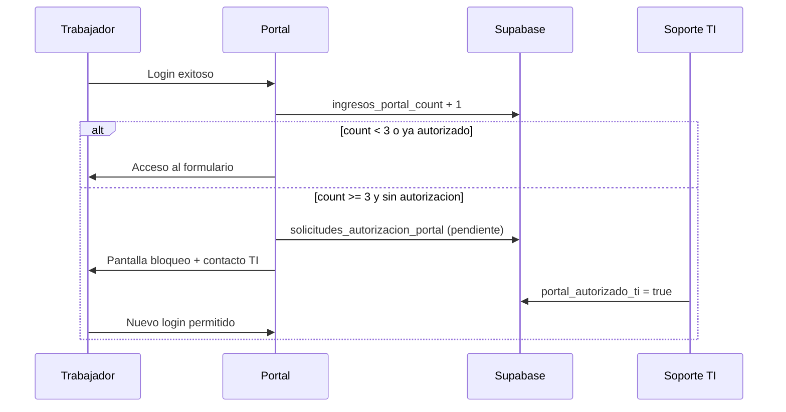

# Plan de ajustes — Portal del Trabajador v1.1

## Resumen de puntos solicitados

| # | Tema | Estado | Accion |
|---|------|--------|--------|
| 1 | Telefono de emergencia (CL/PE) | Implementado v1.1 | Validacion y formato segun pais |
| 2 | Numero de domicilio (CL/PE) | Implementado v1.1 | Patrones S/N, manzana-lote (PE), numero-letra (CL) |
| 3 | Error `trabajadores_sexo_check` | Implementado v1.1 | Valores BD `M`/`F`/`NB` + SQL en `schema_ajustes_portal.sql` |
| 4 | Vigencia documento identidad | Implementado v1.1 | Indicador en pantalla: vigente / por vencer / vencido |
| 5 | Contador de ingresos (3er = TI) | Parcial v1.1 | SQL + bloqueo; desbloqueo manual por TI en Supabase |

---

## 1. Telefono de emergencia

### Reglas

| Pais | Formato esperado | Ejemplo |
|------|------------------|---------|
| Chile | Movil 9 digitos comenzando en 9 | `+56 9 8765 4321` |
| Peru | Movil 9 digitos comenzando en 9 | `+51 987 654 321` |

- Se detecta pais por `nacionalidad` del trabajador (Peru/Peruana → PE, resto → CL).
- Si el telefono tiene valor, se valida antes de confirmar.
- Se normaliza al guardar (solo digitos con prefijo internacional).

### Fase futura (opcional)

- Selector de pais en el campo si hay trabajadores sin nacionalidad cargada.
- Validacion de telefono fijo (codigo de area).

---

## 2. Numero de domicilio (Chile y Peru)

### Formatos aceptados

**Chile:** `1234`, `1234-A`, `12-B`, `S/N`, `sin numero`

**Peru:** `123`, `Mz A Lt 5`, `Mz. B Lt 12`, `S/N`

- Campo de texto (no solo numerico).
- Validacion al confirmar segun pais detectado.
- Misma logica para `teletrabajo_numero` si teletrabajo en direccion distinta.

---

## 3. Genero (`sexo`) y constraint de BD

### Problema

El portal guardaba `Femenino` / `Masculino` / `No binario` pero la BD solo aceptaba `M` / `F` (u otros valores legacy).

### Solucion

| Pantalla | Base de datos |
|----------|----------------|
| Femenino | `F` |
| Masculino | `M` |
| No binario | `NB` |

Ejecutar `schema_ajustes_portal.sql` para ampliar el CHECK.

---

## 4. Vigencia del documento de identidad

### Comportamiento en pantalla

| Estado | Condicion | Accion |
|--------|-----------|--------|
| Vigente | Vence en mas de 90 dias | Mensaje verde |
| Por vencer | Vence en 90 dias o menos | Mensaje amarillo (permite guardar) |
| Vencido | Fecha pasada | Mensaje rojo, **bloquea confirmacion** |
| Sin fecha | Campo vacio | Obligatorio, bloquea confirmacion |

El usuario valida visualmente al elegir la fecha; no requiere integracion externa.

### Fase futura

- Recordatorio por correo 30 dias antes del vencimiento.
- Integracion con validacion de RUT/DNI si RR.HH. lo habilita.

---

## 5. Contador de ingresos y autorizacion TI (3er acceso)

### Flujo



### Columnas en `trabajadores`

- `ingresos_portal_count`
- `portal_requiere_autorizacion_ti`
- `portal_autorizado_ti`
- `fecha_autorizacion_ti`
- `autorizado_por_email`

### Desbloqueo TI (manual, hoy)

En Supabase SQL Editor:

```sql
UPDATE public.trabajadores
SET portal_autorizado_ti = true,
    portal_requiere_autorizacion_ti = false,
    fecha_autorizacion_ti = now(),
    autorizado_por_email = 'ti.soporte@monitoring.cl'
WHERE email_corporativo = 'nombre.apellido@monitoring.cl';
```

### Fase 2 (recomendada)

- Panel admin o vista en Retool/Sheets para TI.
- Notificacion automatica a `ti.soporte@monitoring.cl` al crear solicitud.
- Reset de contador solo con rol `service_role` o admin.

---

## Orden de despliegue

1. Ejecutar `schema_ajustes_portal.sql` en Supabase.
2. Desplegar frontend v1.1 (`npm run dev` local o Vercel).
3. Probar con usuario de prueba: genero, telefono PE/CL, domicilio, fecha vencida.
4. Simular 3 logins y verificar bloqueo + desbloqueo TI.

---

## Pruebas sugeridas

- [ ] Guardar con genero No binario (no debe fallar CHECK).
- [ ] Telefono emergencia `912345678` (CL) y `987654321` (PE).
- [ ] Domicilio `S/N` y `Mz A Lt 5`.
- [ ] Fecha carnet vencida → error visible, no guarda.
- [ ] Tercer login sin autorizacion → bloqueo y mensaje TI.
